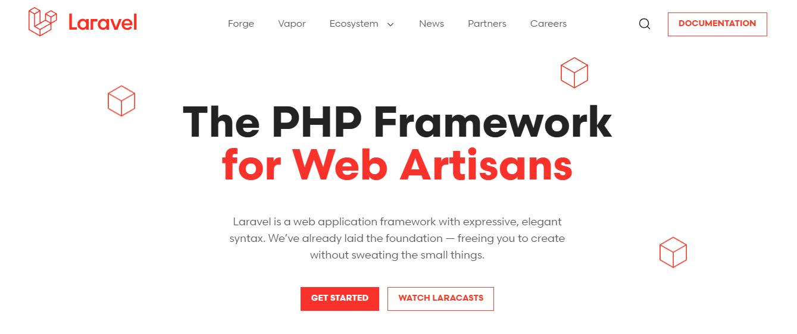

# Создание приложения телефонной книги на Laravel



[Ссылка на официальную страницу Laravel](https://laravel.com/)

📖 **Записная книга контактов** — это простое веб-приложение, разработанное на `Laravel`, позволяющее пользователям удобно управлять своими контактами.

**С помощью этого приложения вы сможете добавлять, редактировать и удалять контактные данные, включая:** _`имя`_, _`фамилию`_, _`отчество`_, _`email`_, _`номер телефона`_ и _`заметки`_

## 🛠️ Функциональные возможности

**Добавление контактов:** Легко сохраняйте новую контактную информацию.

**Редактирование контактов:** Вносите изменения в уже существующие контакты.

**Удаление контактов:** Удаляйте ненужные контакты всего в один клик.

**Простой и интуитивно понятный интерфейс:** Легкий доступ ко всем функциям без лишних шагов.

## 🚀 Технологии


**Laravel:** Мощный PHP-фреймворк для создания веб-приложений.


**MySQL:** Реляционная база данных для хранения контактной информации.


**Blade:** Шаблонизатор Laravel для создания гибких интерфейсов.

## Структура проекта
```
phonebook/
│
├── app/
│   ├── Http/
│   │   ├── Controllers/
│   │   │   └── ContactController.php      # Контроллер для управления контактами
│   ├── Models/
│   │   └── Contact.php                     # Модель для контактов
│
├── database/
│   ├── migrations/
│   │   └── xxxx_xx_xx_create_contacts_table.php  # Миграция для таблицы контактов
│   ├── seeders/
│   │   └── DatabaseSeeder.php              # Сидеры для начальных данных (если нужно)
│
├── resources/
│   ├── views/
│   │   ├── contacts/
│   │   │   ├── index.blade.php             # Шаблон для отображения списка контактов
│   │   │   ├── create.blade.php            # Шаблон для создания нового контакта
│   │   │   └── edit.blade.php              # Шаблон для редактирования контакта
│   │   └── layouts/
│   │       └── app.blade.php               # Общий шаблон приложения
│
├── routes/
│   └── web.php                              # Маршруты приложения
│
├── .env                                      # Файл окружения для настроек
├── composer.json                             # Зависимости проекта
├── package.json                              # Зависимости JavaScript (если есть)
├── artisan                                   # Консольный интерфейс Laravel
├── public/
│   ├── css/                                 # Стили (если есть)
│   ├── js/                                  # Скрипты (если есть)
│   ├── index.php                            # Входная точка приложения
│   └── .htaccess                            # Настройки сервера (если Apache)
│
└── storage/                                  # Логи и временные файлы
```

## Объяснение структуры
```
app/: Основная логика приложения (cодержит контроллеры и модели).
database/: Миграции и сидеры для работы с базой данных.
resources/: Шаблоны Blade и другие ресурсы, такие как изображения или файлы локализации.
routes/: Определение маршрутов для веб-приложения.
public/: Входная точка приложения и статические файлы, доступные извне.
storage/: Логи, кэш и другие временные файлы.
```

**Пошаговое руководство по созданию приложения записной книги на `Laravel` с полями:**
```
1. Имя
2. Фамилия
3. Отчество
4. E-mail
5. Номер телефона
6. Заметки
```

## 📦 Шаг 1: Установка Laravel

**Убедитесь, что установлен Composer.**

**Если он не установлен, выполните:**
```bash
curl -sS https://getcomposer.org/installer | php
sudo mv composer.phar /usr/local/bin/composer
```

**Создайте новый проект Laravel:**
```bash
composer create-project --prefer-dist laravel/laravel phonebook
```

**Перейдите в директорию проекта:**
```bash
cd phonebook
```

## Шаг 2: Настройка базы данных

**Создайте базу данных в MySQL (например, phonebook).**

**Настройте файл .env:**

**Откройте файл `.env` и измените следующие параметры для подключения к вашей базе данных**

```env
DB_CONNECTION=mysql
DB_HOST=127.0.0.1
DB_PORT=3306
DB_DATABASE=phonebook
DB_USERNAME=ваш_пользователь
DB_PASSWORD=ваш_пароль
```

## Шаг 3: Создание модели и миграции

**Создайте модель и миграцию для контактов:**
```bash
php artisan make:model Contact -m
```

**Откройте файл миграции (`database/migrations/xxxx_xx_xx_create_contacts_table.php`) и добавьте следующие поля:**

```php
public function up()
{
    Schema::create('contacts', function (Blueprint $table) {
        $table->id();
        $table->string('first_name');  // Имя
        $table->string('last_name');   // Фамилия
        $table->string('middle_name')->nullable(); // Отчество
        $table->string('email')->nullable(); // Email
        $table->string('phone');       // Номер телефона
        $table->text('notes')->nullable(); // Заметки
        $table->timestamps();
    });
}
```

**Выполните миграцию:**
```bash
php artisan migrate
```

## Шаг 4: Создание контроллера

**Создайте контроллер для управления контактами:**

```bash
php artisan make:controller ContactController
```

## Шаг 5: Реализация методов контроллера

**Откройте `ContactController.php` и добавьте методы для `CRUD` операций:**

```
namespace App\Http\Controllers;

use App\Models\Contact;
use Illuminate\Http\Request;

class ContactController extends Controller
{
    public function index()
    {
        $contacts = Contact::all();
        return view('contacts.index', compact('contacts'));
    }

    public function create()
    {
        return view('contacts.create');
    }

    public function store(Request $request)
    {
        $request->validate([
            'first_name' => 'required|string|max:255',
            'last_name' => 'required|string|max:255',
            'middle_name' => 'nullable|string|max:255',
            'email' => 'nullable|email|max:255',
            'phone' => 'required|string|max:15',
            'notes' => 'nullable|string',
        ]);

        Contact::create($request->all());
        return redirect()->route('contacts.index');
    }

    public function edit(Contact $contact)
    {
        return view('contacts.edit', compact('contact'));
    }

    public function update(Request $request, Contact $contact)
    {
        $request->validate([
            'first_name' => 'required|string|max:255',
            'last_name' => 'required|string|max:255',
            'middle_name' => 'nullable|string|max:255',
            'email' => 'nullable|email|max:255',
            'phone' => 'required|string|max:15',
            'notes' => 'nullable|string',
        ]);

        $contact->update($request->all());
        return redirect()->route('contacts.index');
    }

    public function destroy(Contact $contact)
    {
        $contact->delete();
        return redirect()->route('contacts.index');
    }
}
```

## Шаг 6: Настройка маршрутов

**Откройте файл `routes/web.php` и добавьте маршруты для контроллера:**

```php
use App\Http\Controllers\ContactController;

Route::resource('contacts', ContactController::class);
```

## Шаг 7: Создание представлений

Создайте папку `contacts` в `resources/views`.

**Создайте файл `index.blade.php` в папке `contacts`:**

```blade
@extends('layouts.app')

@section('content')
    <h1>Записная книга</h1>
    <a href="{{ route('contacts.create') }}">Добавить контакт</a>
    <table>
        <thead>
            <tr>
                <th>Имя</th>
                <th>Фамилия</th>
                <th>Отчество</th>
                <th>Email</th>
                <th>Телефон</th>
                <th>Заметки</th>
                <th>Действия</th>
            </tr>
        </thead>
        <tbody>
            @foreach ($contacts as $contact)
                <tr>
                    <td>{{ $contact->first_name }}</td>
                    <td>{{ $contact->last_name }}</td>
                    <td>{{ $contact->middle_name }}</td>
                    <td>{{ $contact->email }}</td>
                    <td>{{ $contact->phone }}</td>
                    <td>{{ $contact->notes }}</td>
                    <td>
                        <a href="{{ route('contacts.edit', $contact) }}">Редактировать</a>
                        <form action="{{ route('contacts.destroy', $contact) }}" method="POST" style="display:inline;">
                            @csrf
                            @method('DELETE')
                            <button type="submit">Удалить</button>
                        </form>
                    </td>
                </tr>
            @endforeach
        </tbody>
    </table>
@endsection
```

**Создайте файл `create.blade.php` в папке `contacts`:**
```blade
@extends('layouts.app')

@section('content')
    <h1>Добавить контакт</h1>
    <form action="{{ route('contacts.store') }}" method="POST">
        @csrf
        <label for="first_name">Имя:</label>
        <input type="text" name="first_name" id="first_name" required>

        <label for="last_name">Фамилия:</label>
        <input type="text" name="last_name" id="last_name" required>

        <label for="middle_name">Отчество:</label>
        <input type="text" name="middle_name" id="middle_name">

        <label for="email">Email:</label>
        <input type="email" name="email" id="email">

        <label for="phone">Телефон:</label>
        <input type="text" name="phone" id="phone" required>

        <label for="notes">Заметки:</label>
        <textarea name="notes" id="notes"></textarea>

        <button type="submit">Добавить</button>
    </form>
    <a href="{{ route('contacts.index') }}">Назад</a>
@endsection
```

**Создайте файл `edit.blade.php` в папке `contacts`:**

```blade
@extends('layouts.app')

@section('content')
    <h1>Редактировать контакт</h1>
    <form action="{{ route('contacts.update', $contact) }}" method="POST">
        @csrf
        @method('PUT')
        <label for="first_name">Имя:</label>
        <input type="text" name="first_name" id="first_name" value="{{ $contact->first_name }}" required>

        <label for="last_name">Фамилия:</label>
        <input type="text" name="last_name" id="last_name" value="{{ $contact->last_name }}" required>

        <label for="middle_name">Отчество:</label>
        <input type="text" name="middle_name" id="middle_name" value="{{ $contact->middle_name }}">

        <label for="email">Email:</label>
        <input type="email" name="email" id="email" value="{{ $contact->email }}">

        <label for="phone">Телефон:</label>
        <input type="text" name="phone" id="phone" value="{{ $contact->phone }}" required>

        <label for="notes">Заметки:</label>
        <textarea name="notes" id="notes">{{ $contact->notes }}</textarea>

        <button type="submit">Обновить</button>
    </form>
    <a href="{{ route('contacts.index') }}">Назад</a>
@endsection
```

## Шаг 8: Создание базового шаблона

**Создайте файл `layouts/app.blade.php` для общего оформления:**
```blade
<!DOCTYPE html>
<html lang="ru">
<head>
    <meta charset="UTF-8">
    <meta name="viewport" content="width=device-width, initial-scale=1.0">
    <title>Записная книга</title>
</head>
<body>
    <div class="container">
        @yield('content')
    </div>
</body>
</html>
```

## Шаг 9: Запуск приложения

**Запустите сервер:**
```bash
php artisan serve
```

**Откройте браузер и перейдите по адресу `http://127.0.0.1:8000/contacts`.**

Теперь у вас есть полностью функционирующее приложение записной книги на Laravel.

Вы можете добавлять, редактировать и удалять контакты с указанными полями.

Если у вас есть вопросы или вы хотите внести дополнительные изменения, дайте знать.


**Автор:** Дуплей Максим Игоревич

**Дата:** 21.09.2024

**Версия:** 1.0